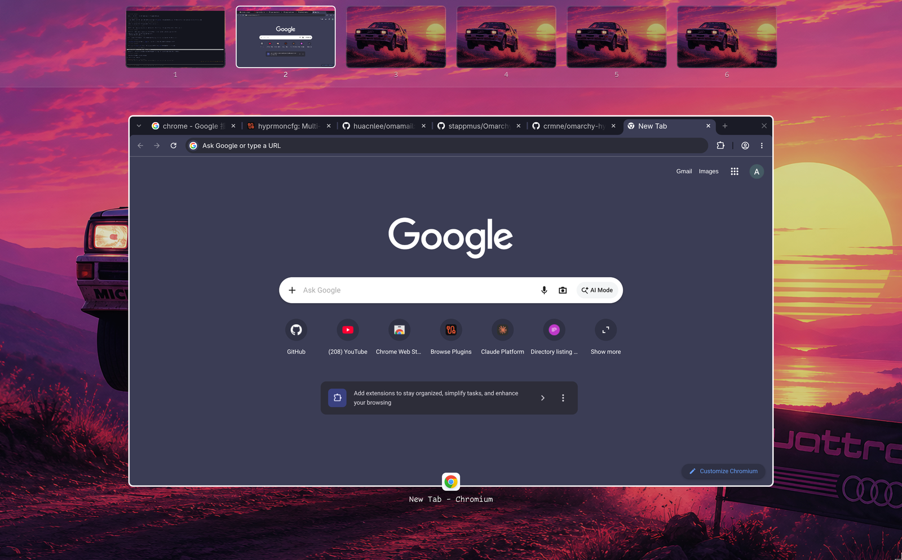

# Mission Control

A macOS-style workspace overview for [Omarchy](https://omarchy.org), as a shell plugin.



A strip of live desktop thumbnails across the top, and underneath it the current
desktop's windows shrunk out so none overlaps, each with its app icon and title.
Click a window to jump to it, click a desktop to switch to it.

The open is two-phase, and that is the whole point: the surface goes up with
every window drawn at its real size and position — pixel-for-pixel the desktop
you were already looking at — and only then do the windows shrink into place. So
your desktop appears to shrink, rather than a different-looking screen fading in
over it.

The thumbnails are live, including windows on workspaces you cannot currently
see.

## Install

```bash
omarchy plugin add https://github.com/AndyWeiBoan/omarchy-mission-control --enable
```

Then bind a key — plugins cannot bind keys themselves. In `~/.config/hypr/bindings.lua`:

```lua
o.bind("CTRL + UP", "Mission Control",
  "omarchy-shell shell toggle io.github.andyweiboan.missioncontrol '{}'")

-- Optional: a dedicated exit, so CTRL+UP is never an accidental re-open.
o.bind("CTRL + DOWN", "Close Mission Control",
  "omarchy-shell shell hide io.github.andyweiboan.missioncontrol")
```

For the legacy (non-Lua) Hyprland config format, see [`install/bindings.conf`](install/bindings.conf).

Touchpad gestures are optional and live in [`install/gestures.lua`](install/gestures.lua):
three- or four-finger swipe up to open, swipe down to close.

## Keys

| Key | Action |
| --- | --- |
| `←` `→` | Walk the Spaces strip — switches desktop **without** closing, so you can look before you leap |
| `↑` `↓` | Move between the windows of the current desktop |
| `Tab` | Cycle windows |
| `1`–`9` | Jump straight to that desktop |
| `Enter` | Open the selected window |
| `Esc`, click the backdrop | Close |
| `CTRL`+`↓` / `CTRL`+`↑` | Close (mirrors whatever opened it) |

Clicking a desktop thumbnail switches to it and closes. Clicking a window
focuses it and closes.

## Requirements

- Omarchy with shell plugin support (`omarchy plugin list` works)
- Hyprland — window geometry comes from its IPC, and thumbnails from
  `wlr-screencopy`
- **Persistent workspaces**, if you want the strip to be stable. Hyprland only
  creates a workspace when something lands on it, so without pinning them the
  strip grows and shrinks as you work. In `~/.config/hypr/looknfeel.lua`:

  ```lua
  hl.workspace({ id = 1, persistent = true })  -- ... and so on for 2..N
  ```

  It works without this; the strip is just less stable.

## Theming

Labels follow the shell's menu font, so `OMARCHY_MENU_FONT` is honoured and the
plugin matches the rest of Omarchy. The background is your real wallpaper, read
from Omarchy's `current/background` link, so a theme switch is picked up with no
reload.

The overview is deliberately **not** blurred — macOS does not blur the desktop
in Mission Control either; only the Spaces strip along the top is a frosted
band. Do not add a compositor `blur = true` layer rule for the
`mission-control` namespace: with hyprbars installed it makes title bars flicker
between transparent and coloured on every redraw, and
`decoration:blur:new_optimizations = false` does not stop it.

## Why not hyprexpo

hyprexpo does a similar job inside the compositor, but it is a render pass, not
a client: it clears the whole monitor to `bg_col` every frame, so a transparent
`bg_col` still paints black and nothing shows through from underneath, and
`wallpaper_bg = 1` draws Hyprland's *built-in* wallpaper, which Omarchy does not
use. Owning a surface is the only way to get the real desktop behind the
overview.

Both were measured rather than assumed — see [docs/FINDINGS.md](docs/FINDINGS.md).

## Performance

The plugin declares `keepLoaded: true`, so the shell mounts it at startup and it
stays mounted, hidden, until summoned. That is not an optimisation detail, it is
the difference between usable and not: a standalone predecessor launched a
Quickshell process per keypress and took ~340ms before anything appeared —
~145ms of Qt/QML startup plus ~190ms decoding a 5120×2880 wallpaper, neither
avoidable per launch. Mounted once, `summon` to mapped surface measures 37–48ms
on this machine.

Window captures run only while the overview is shown, so a mounted-but-hidden
plugin costs nothing beyond the decoded wallpaper it is holding.

## Licence

MIT — see [LICENSE](LICENSE).
